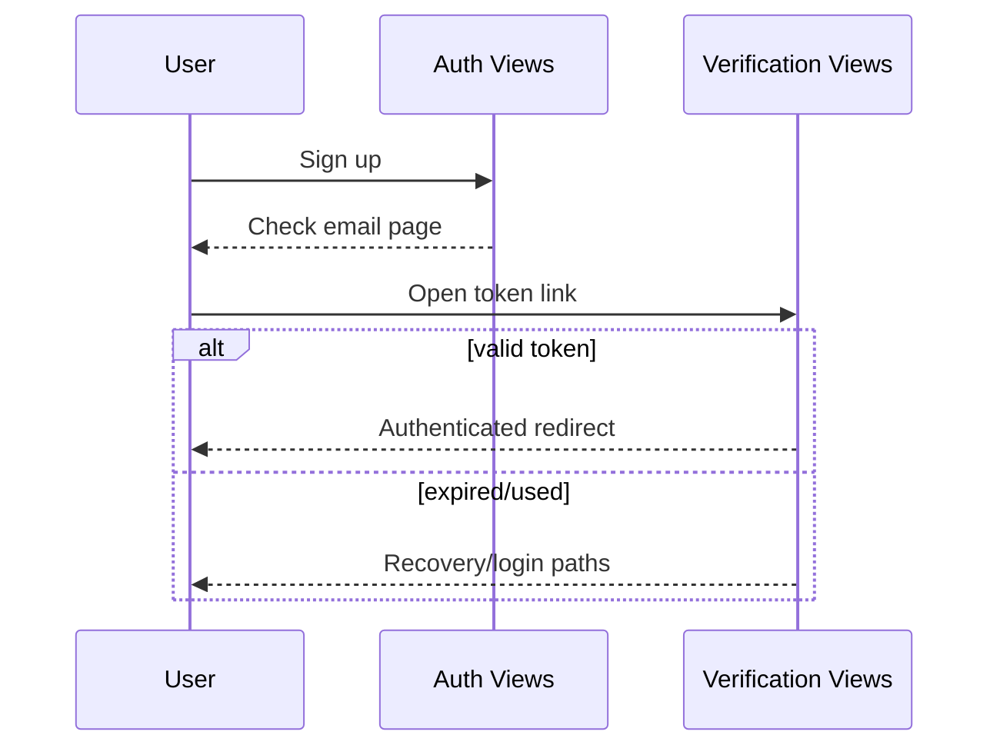

# Account Access and Verification Journey — Design Document

## Overview

This design streamlines the existing auth progression by tightening transitions and recovery CTAs across signup/login/verification states. It reuses current views and templates.

## Design Goals

1. Clear progression through signup -> verify -> login/authenticated entry.
2. Eliminate auth dead ends.
3. Keep existing verification security model intact.

## Architecture

## Affected Surfaces

- `registration/signup.html`
- `registration/login.html`
- `registration/email_verify.html`
- `registration/email_verify_expired.html`
- `registration/email_verify_used.html`
- `registration/resend_verification.html`
- `registration/logged_out.html`

## Behavioral Design

- Each auth state page includes explicit next action.
- Login block state includes direct resend route.
- Verification outcome pages use consistent navigation affordances.

## Testing Strategy

- End-to-end auth progression tests
- Unverified login block + resend tests
- Expired/used token navigation tests
- Dead-end checks for each auth template

## Risks and Mitigations

- Risk: introducing auth regressions.
  - Mitigation: narrow template/view changes + targeted auth tests.
