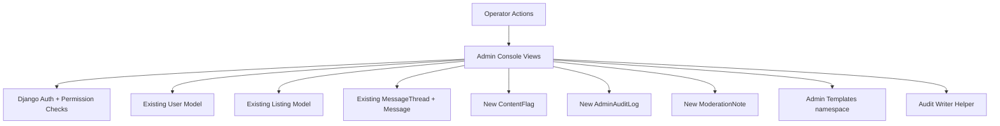
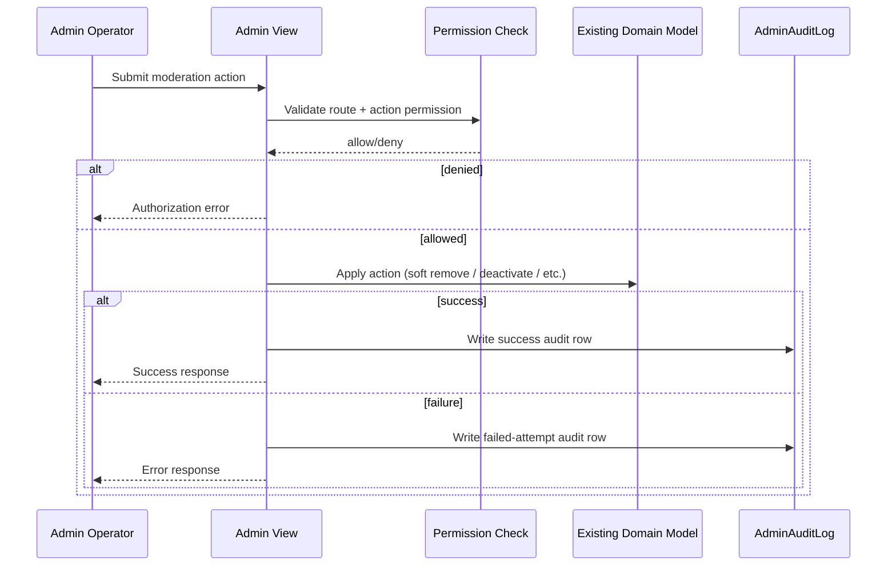

# Admin Console — Design Document

## Overview

This design implements a lean internal Admin Console for trusted operators. It is reuse-first:

- Reuse existing Django auth/session model
- Reuse existing `User`, `Listing`, `MessageThread`, and status/state contracts
- Reuse existing template/view patterns in `marketplace`
- Add only minimal operator-specific models where no reusable equivalent exists

The design prioritizes reversible moderation actions, explicit confirmations for destructive actions, and complete auditability.

## Design Goals

1. Ship an internal operator console with strong access separation from user-facing flows.
2. Use existing domain models as system-of-record for users, listings, and threads.
3. Minimize new abstractions and keep data model additions narrow.
4. Ensure all admin interventions are traceable and reviewable.
5. Guard message visibility with case-linked justification.

## Reuse-First Architecture

### UI Boundary

- Admin Console routes live under a dedicated URL namespace (for example `/ops/`).
- Admin templates use a dedicated base layout (for example `templates/admin_console/base.html`), visually distinct from end-user pages.
- Normal user navigation does not expose admin routes.

## Access Model

### Permission Representation

Reuse Django’s built-in auth primitives:

- `User.is_staff` gates entry to Admin Console
- Fine-grained permissions/capabilities are role-mapped with Django Groups and model/view permissions (for example operator vs support)

This avoids introducing a separate role framework.

### Authorization Policy

- Route-level guard: authenticated + `is_staff=True`
- Action-level guard: permission checks per operation (deactivate/reactivate, listing hard delete, flag resolution, message oversight access)
- All denied actions return explicit authorization failure (no silent fallthrough)

## Data Model Design

### Reused Existing Models

- `marketplace.models.User`
- `marketplace.models.Listing`
- `marketplace.models.MessageThread`
- `marketplace.models.Message`

### New Model: `ContentFlag`

Purpose: persistent user-submitted moderation reports and queue state.

Key fields:

- `id`
- `reporter` (FK -> `User`)
- `target_content_type` (FK -> `django.contrib.contenttypes.models.ContentType`)
- `target_object_id` (string/int field for object primary key)
- `target` (`GenericForeignKey(target_content_type, target_object_id)`)
- `target_type` (derived/display enum-like helper for queue UI; v1 expected values: `user`, `listing`)
- `reason_category` (enum controlled set)
- `reason_note` (optional text)
- `status` (enum: `open`, `dismissed`, `resolved`, `escalated`)
- `resolved_by` (nullable FK -> `User`, staff)
- `resolved_at` (nullable datetime)
- `resolution_note` (optional text)
- timestamps (`created_at`, `updated_at`)

Reason category controlled set (v1 minimum):

- `spam`
- `fraudulent_listing`
- `prohibited_item`
- `abusive_behavior`
- `misleading_content`
- `other`

V1 target support constraint:

- Flag creation UI and validation only permit `User` and `Listing` targets in v1, even though the storage model is generic for future moderation targets.

### New Model: `AdminAuditLog`

Purpose: immutable log of admin actions and sensitive admin reads.

Key fields:

- `id`
- `actor` (FK -> `User`, staff)
- `action_type` (string/enum)
- `target_type` (string/enum: `user`, `listing`, `thread`, `flag`, etc.)
- `target_id` (string/int)
- `reason` (optional text)
- `status` (`success` / `failed`)
- `failure_context` (optional text)
- `metadata_json` (optional structured payload)
- `created_at`

Immutability contract:

- append-only writes
- no update/delete path in application code

### New Model: `ModerationNote` (Recommended)

Purpose: private internal notes for user/listing/flag contexts.

Key fields:

- `id`
- `author` (FK -> `User`, staff)
- `target_type` (enum: `user`, `listing`, `flag`)
- `target_id`
- `body`
- timestamps (`created_at`, `updated_at`)

Visibility:

- admin-only surfaces
- never exposed in end-user templates or APIs

## Service/Helper Design (Lean)

No heavy service layer is introduced. Use lightweight helpers inside `marketplace`:

- `admin_permissions.py` for reusable permission predicates
- `admin_audit.py` single helper for writing audit rows consistently
- optional `admin_metrics.py` for dashboard query aggregation

This keeps logic organized while preserving existing Django view-first patterns.

## Functional Area Design

### 1) User Management

- User search: by ID, email, display name
- User detail: account state, listing summary by status, messaging summary, moderation history
- Actions: deactivate/reactivate with confirmation
- Notes: attach/view internal moderation notes
- Every mutate action writes `AdminAuditLog`

### 2) Listing Moderation

- Listing search: by listing ID, owner, text, status
- Listing detail includes owner panel with direct link to owner admin user detail page
- Actions:
  - soft remove (reversible, preferred)
  - restore
  - forced pause
  - forced expiry
  - hard delete (restricted permission + two-step confirmation)
- Hard-delete behavior preserves associated thread history as historical records (listing link gracefully degraded)
- Every mutate action writes `AdminAuditLog`

### 3) Flagging + Moderation Queue

- User-facing flag submission creates `ContentFlag`
- Queue view prioritizes unresolved/open flags and shows age
- Flag detail supports: dismiss, resolve-with-action, escalate
- Multi-flag context: view related flags on same target
- Bulk resolution (recommended): resolve multiple open flags for one target in one action
- Every resolution path writes `AdminAuditLog`
- In v1, flaggable targets remain limited to users and listings; GenericForeignKey is used to avoid future schema changes when new target types are added.

### 4) Messaging Oversight

- Entry path only via moderation context (flag/user/listing investigation)
- Opening thread requires justification text
- Thread access event logged in `AdminAuditLog`
- No free-form global browse of all private threads in v1

### 5) Dashboard + Global Search

Dashboard minimum metrics (query-time aggregation):

- total users
- new users (last 7 days)
- active listings
- listings created (last 7 days)
- conversations started (last 7 days)
- unresolved flags
- recent moderation actions

Global search returns grouped hits:

- users
- listings
- threads

Moderation badges appear on flagged/moderated objects.

## Request Flow (Moderation Action)

## URL and Template Layout

Proposed namespace:

- `marketplace/urls_admin.py` (or admin routes section in existing urls)
- mount under `/ops/`

Example routes:

- `/ops/` dashboard
- `/ops/users/` search list
- `/ops/users/<id>/` detail
- `/ops/listings/` search list
- `/ops/listings/<id>/` detail
- `/ops/flags/` queue
- `/ops/flags/<id>/` detail
- `/ops/search/` global search
- `/ops/audit/` audit log explorer

Template namespace:

- `templates/admin_console/*.html`

## Safety and Confirmation Patterns

- Reversible action primary buttons (soft remove, restore, pause, reactivate)
- Irreversible actions require confirm form and explicit warning copy
- Optional reason field for all non-trivial moderation actions
- Hard delete restricted to elevated permission only

## Testing Strategy

### Unit Tests

- permission guard predicates
- audit helper writes required fields
- flag reason-category validation
- bulk flag resolution target-scope validation

### Integration Tests

- non-staff blocked from all `/ops/` routes
- listing detail shows owner link to admin user detail
- soft remove/restore visibility behavior
- forced pause/expiry state transitions
- hard delete confirmation and restricted permission path
- message oversight blocked without moderation context
- message oversight requires justification and logs audit
- dashboard metric cards render required minimum set
- global search grouped results behavior

### Regression Tests

- no admin-only notes/flags leak into end-user pages
- existing user-facing flows unaffected by admin-console route additions

## Migration and Rollout

1. Add new models (`ContentFlag`, `AdminAuditLog`, `ModerationNote`) in additive migration.
2. Add admin route namespace and staff guard.
3. Ship dashboard + read-only search/detail pages first.
4. Enable reversible moderation actions.
5. Enable restricted hard delete and message oversight justification flow.
6. Validate audit completeness and permission boundaries before broad operator use.

## Risks and Mitigations

- Risk: Over-broad message access.
  - Mitigation: context-linked access only + required justification + audit.
- Risk: Irreversible moderation mistakes.
  - Mitigation: reversible-first UX + hard-delete confirmation + elevated permission.
- Risk: Operator action ambiguity.
  - Mitigation: explicit audit schema and moderation history views.
- Risk: Over-engineering.
  - Mitigation: view-first reuse of existing models; minimal helper modules only.

## Open Design Decisions

1. Should support operators (non-founder staff) have separate group defaults from full operators?
2. Should unresolved-flag queue default sort be oldest-first (aging) or highest-volume-target-first?
3. Should hard delete be restricted to superusers only in v1?
