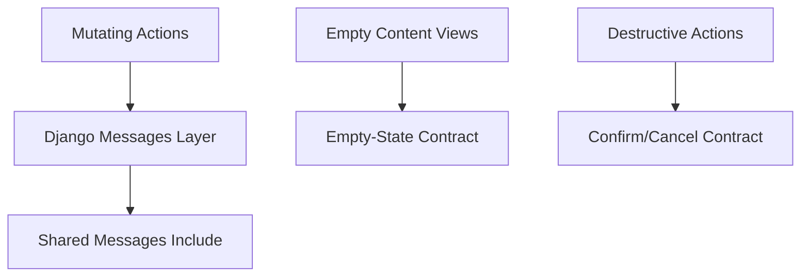

# Cross-Page Feedback, Recovery, and Empty-State System — Design Document

## Overview

This design introduces a reusable behavior contract for feedback and recovery patterns across existing pages. It uses existing Django message infrastructure, current templates, and existing action endpoints.

## Design Goals

1. Standardize success/error/warning messaging semantics.
2. Guarantee empty-state CTA presence on key pages.
3. Unify confirmation behavior for destructive actions.
4. Reduce dead ends without changing business logic.

## Reuse-First Architecture

## Components and Files Affected

- `templates/includes/_messages.html`
- User-facing templates with empty states
- Existing confirmation templates (`listing_delete_confirm.html` and similar)
- Views that currently emit messages

## Behavioral Design

### Messaging
- Success/error messages are concise and action-specific.
- Failures include a recovery hint where possible.

### Empty States
- Each major list/surface includes one primary CTA.
- CTA target maps to nearest meaningful step.

### Confirmation
- Destructive actions require explicit confirm + safe cancel return path.

## Testing Strategy

- Validate message presence for key actions.
- Validate empty-state CTA presence and destination.
- Validate cancel path correctness for confirmation pages.
- Regression check business logic unchanged.

## Risks and Mitigations

- Risk: inconsistent adoption across templates.
  - Mitigation: audit checklist of target pages + coverage tests.
- Risk: overcoupling to presentation.
  - Mitigation: behavior-level contracts, not style mandates.
