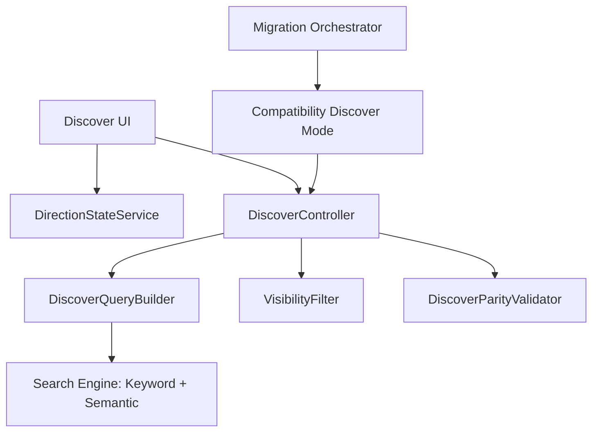

# Discover Direction and Visibility Contract Design Document

## Overview

This design makes discover direction explicit (`Find Supply` or `Find Demand`) and codifies visibility so active counterpart listings remain discoverable to authenticated users independent of role assumptions. The implementation separates direction state management, query construction, and visibility filtering into explicit components. Compatibility validation ensures current discover behavior is preserved while removing role-inferred logic. All sequencing and rollback are governed by `migration-safety-and-compatibility-rails`.

## Dependency Alignment

- **Required predecessor:** `migration-safety-and-compatibility-rails`
- Discover behavior changes are released via checkpointed compatibility/cutover stages.
- Role-inferred discover assumptions are removed only after parity gates pass.
- Rollback to previous discover behavior remains available until cleanup window closure.

## Architecture



**Key Architectural Principles:**

- Direction is explicit user input, never inferred from role.
- Query behavior is symmetric between directions except type filter.
- Visibility is based on listing status and auth scope, not suggestion gates.
- Session state for direction is deterministic and clearable.

## Components and Interfaces

### DirectionStateService Module

**Key Methods:**

- `get_direction(session: SessionStore): DiscoverDirection`
- `set_direction(session: SessionStore, direction: DiscoverDirection): void`
- `clear_direction(session: SessionStore): void`

### DiscoverQueryBuilder Module

**Key Methods:**

- `build_query(input: DiscoverInput): DiscoverQuery`
- `resolve_type_filter(direction: DiscoverDirection): ListingType`

### VisibilityFilter Module

**Key Methods:**

- `filter_active_results(results: ListingRecord[]): ListingRecord[]`
- `enforce_visibility_contract(results: ListingRecord[]): VisibilityValidationResult`

### DiscoverDirection Interface

```typescript
type DiscoverDirection = "FIND_SUPPLY" | "FIND_DEMAND";
```

### DiscoverQuery Interface

```typescript
interface DiscoverQuery {
  direction: DiscoverDirection;
  listingType: "SUPPLY" | "DEMAND";
  textQuery: string | null;
  category: string | null;
  country: string | null;
  sortBy: string;
}
```

## Data and State Rules

- Discover direction persists in session with other discover parameters.
- Clear Search clears persisted direction and linked search state.
- Missing/invalid direction resolves via deterministic default rule without role inference.

## Cutover Design

1. Introduce direction state service and explicit direction UI contract.
2. Route discover query construction through direction-aware query builder.
3. Enforce visibility contract on active listing statuses.
4. Run compatibility parity checks against existing discover behavior.
5. Cut over canonical discover behavior to explicit direction + visibility contract.
6. Remove legacy role-inference branches during cleanup stage.

## Error Handling

| Error Type | Condition | Recovery Strategy |
|------------|-----------|-------------------|
| `InvalidDirectionState` | Session direction missing/invalid | Apply deterministic default and log event |
| `TypeFilterMismatch` | Direction and query type mismatch | Reject request path and rebuild query |
| `VisibilityContractViolation` | Active counterpart listings improperly filtered | Fail validation and block cutover |
| `DiscoverParityFailure` | Discover results diverge beyond threshold | Hold checkpoint and remediate |

## Testing Strategy

### Unit Tests

- Direction set/get/clear behavior.
- Query builder mapping from direction to listing type.
- Visibility filtering by status contract.

### Integration Tests

- Discover flows for both directions with keyword and semantic modes.
- Session persistence and Clear Search behavior.
- Active/non-active visibility contract enforcement.
- Compatibility parity and cutover rollback drill.

### Gate Criteria

- No role-inferred discover branch remains in canonical path.
- Direction and visibility tests pass for both modes.
- Active listing discoverability contract validated for authenticated users.

## Scope Boundaries

- In scope: explicit direction selection, counterpart type filtering, session state behavior, visibility contract.
- Out of scope: new ranking models, unrelated discover feature expansion, deferred marketplace features.
