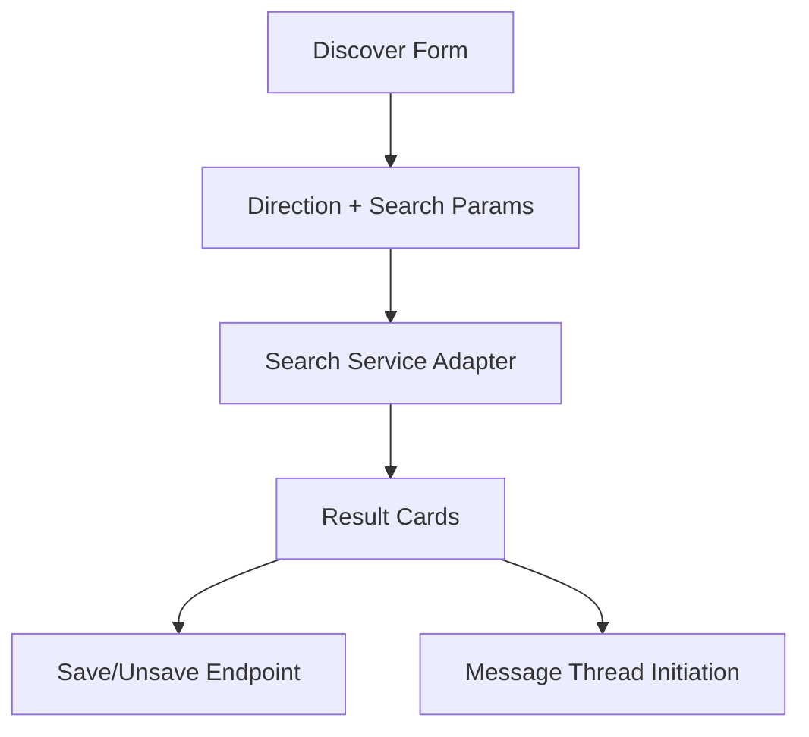

# Discover Search Experience — Design Document

## Overview

This design improves Discover as the primary sourcing entry point by tightening direction semantics, search controls, and result actions. Existing search services and endpoints are reused.

## Design Goals

1. High clarity for `Find Supply` vs `Find Demand`.
2. Reliable discover-state continuity after actions.
3. Strong conversion from results to save/message.

## Reuse-First Architecture

## Affected Surfaces

- `marketplace/discover.html`
- discover-related actions in `views.py`
- discover session-state keys and clear behavior

## Behavioral Design

- Direction-specific mapping remains explicit.
- Search controls and sort/filter grouping are consistent.
- Result cards always include open/save/message actions.
- Empty state includes refinement guidance.

## Testing Strategy

- Direction isolation test coverage
- Save/unsave/message transition tests
- Clear/reset behavior tests
- Empty-state/short-query hint tests

## Risks and Mitigations

- Risk: state persistence confusion.
  - Mitigation: explicit keep/clear contract and regression tests.
