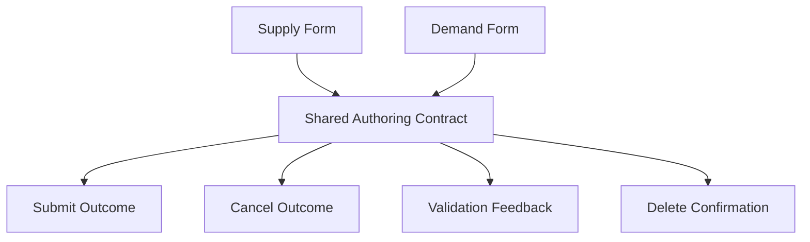

# Listing Authoring and Edit Flows — Design Document

## Overview

This design standardizes create/edit/delete-confirm interactions for supply and demand listing flows, with predictable returns and clear validation messaging.

## Design Goals

1. Reduce confusion in create/edit/cancel paths.
2. Keep validation recovery fast and obvious.
3. Preserve current domain constraints.

## Reuse-First Architecture

## Affected Surfaces

- `marketplace/supply_lot_form.html`
- `marketplace/demand_post_form.html`
- `marketplace/listing_delete_confirm.html`
- Form-related listing views

## Behavioral Design

- Align cancel behavior by create vs edit mode.
- Ensure validation messages are visible and useful.
- Keep delete confirm pattern explicit and consistent.

## Testing Strategy

- Form submit/cancel path tests
- Validation feedback tests
- Delete confirm/cancel tests
- Permission regression tests

## Risks and Mitigations

- Risk: subtle path regressions in edit/create mode.
  - Mitigation: dedicated transition tests for both modes and listing types.
