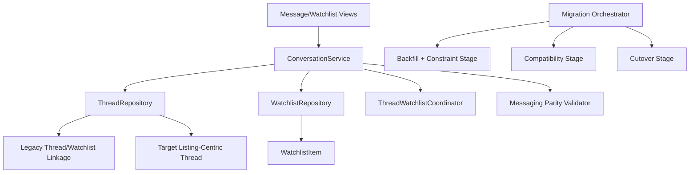

# Listing-Centric Messaging and Watchlist Decoupling Design Document

## Overview

This design anchors threads to listings, enforces one thread per `(listing, initiator)` pair, links message initiation to auto-save behavior, and decouples watchlist/thread storage. The migration preserves current inbox/thread behavior through compatibility adapters and parity checks. Data integrity is maintained with deterministic backfill and unique constraints in the target model. All sequencing, rollback, and destructive gating depend on `migration-safety-and-compatibility-rails`.

## Dependency Alignment

- **Required predecessor:** `migration-safety-and-compatibility-rails`
- Schema changes are additive-first and checkpoint-gated.
- Cutover occurs only after parity and integrity validations pass.
- Legacy OneToOne linkage removal is cleanup-stage only.

## Architecture



**Key Architectural Principles:**

- Thread identity is listing-centric and initiator-centric.
- Thread/watchlist are independent records with coordinated behavior.
- Auto-save and thread initiation share transaction outcome semantics.
- Inbox/thread UX behavior remains stable through compatibility mode.

## Components and Interfaces

### ConversationService Module

**Key Methods:**

- `start_thread(user_id: int, listing_id: int, initial_message: string): ThreadStartResult`
- `send_message(user_id: int, thread_id: int, body: string): MessageResult`
- `get_inbox(user_id: int): InboxViewModel`

### ThreadWatchlistCoordinator Module

**Key Methods:**

- `ensure_thread_uniqueness(listing_id: int, initiator_id: int): ThreadRecord`
- `ensure_watchlist_saved(user_id: int, listing_id: int): WatchlistRecord`
- `start_thread_with_autosave(request: StartThreadRequest): ThreadStartResult`

### MessagingCompatibilityRepository Module

**Key Methods:**

- `read_thread(thread_id: int): ThreadRecord`
- `write_thread(change: ThreadChange): WriteResult`
- `backfill_legacy_linked_records(batch_spec: BatchSpec): BackfillBatchResult`

### ThreadRecord Interface

```typescript
interface ThreadRecord {
  id: number;
  listingId: number;
  createdByUserId: number;
  createdAt: string;
}
```

### StartThreadRequest Interface

```typescript
interface StartThreadRequest {
  listingId: number;
  initiatorUserId: number;
  initialMessage: string;
}
```

## Data Models

### Thread Uniqueness Contract

- Unique constraint on `(listing_id, created_by_user_id)`.
- Thread owner counterpart is derived from `listing.created_by_user`.

### Watchlist/Thread Correlation Contract

- No direct OneToOne FK required between thread and watchlist.
- Correlation key is `(user_id, listing_id)`.

### MessageStartAudit Entity

```typescript
interface MessageStartAudit {
  listingId: number;
  initiatorUserId: number;
  threadId: number | null;
  watchlistItemId: number | null;
  status: "success" | "failed";
  reasonCode: string | null;
  createdAt: string;
}
```

## Migration and Cutover Design

1. Add/confirm listing-centric thread fields and uniqueness constraints.
2. Backfill legacy thread/watchlist coupled records into independent equivalents.
3. Enable coordinator-based compatibility behavior for thread initiation + auto-save.
4. Validate inbox/thread/watchlist parity and divergence metrics.
5. Cut over canonical thread/watchlist behavior to decoupled architecture.
6. Remove legacy direct coupling in cleanup stage.

## Error Handling

| Error Type | Condition | Recovery Strategy |
|------------|-----------|-------------------|
| `ThreadUniquenessConflict` | Duplicate thread create race for same pair | Resolve to existing thread deterministically |
| `AutoSaveFailure` | Thread start cannot ensure watchlist save | Fail initiation transaction outcome, log reason |
| `BackfillLinkageFailure` | Legacy coupled data cannot map cleanly | Record failure and block cutover |
| `MessagingParityMismatch` | Inbox/thread behavior divergence in compatibility | Hold checkpoint and remediate |

## Testing Strategy

### Unit Tests

- Thread uniqueness resolution logic.
- Auto-save on message initiation behavior.
- Correlation behavior without direct OneToOne dependency.

### Integration Tests

- Thread initiation idempotence and concurrent initiation handling.
- Inbox/thread parity across compatibility and cutover.
- Watchlist lifecycle behavior for messaging-initiated saves.
- Cutover + rollback drill for messaging/watchlist subsystem.

### Gate Criteria

- `(listing, initiator)` uniqueness enforced without regressions.
- Messaging/watchlist parity tests pass for launch-critical flows.
- No canonical runtime dependency on legacy direct thread-watchlist linkage post-cutover.

## Scope Boundaries

- In scope: listing-centric thread semantics, auto-save coupling behavior, watchlist/thread decoupled storage.
- Out of scope: recommendation ranking changes, broader profile/discover feature changes, deferred marketplace features.
