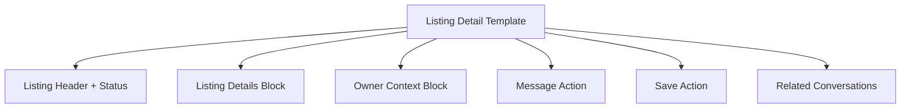

# Listing Detail Conversion Surface — Design Document

## Overview

This design standardizes listing detail surfaces (supply and demand) around conversion and context: evaluate listing -> message/save -> continue workflow.

## Design Goals

1. Make listing details quickly scannable.
2. Keep primary message action easy to locate.
3. Preserve context links to conversations and related actions.

## Reuse-First Architecture

## Affected Surfaces

- `marketplace/demand_post_detail.html`
- `marketplace/supply_lot_detail.html`
- Related suggestion action fragments

## Behavioral Design

- Align supply/demand detail information layout patterns.
- Keep message/save action placement consistent.
- Preserve listing-thread context links for owners.

## Testing Strategy

- Template interaction tests for action visibility by status.
- Transition tests to thread and back.
- Permission/regression tests for non-owner access boundaries.

## Risks and Mitigations

- Risk: action visibility differs by type/status.
  - Mitigation: shared detail contract + status-based tests.
