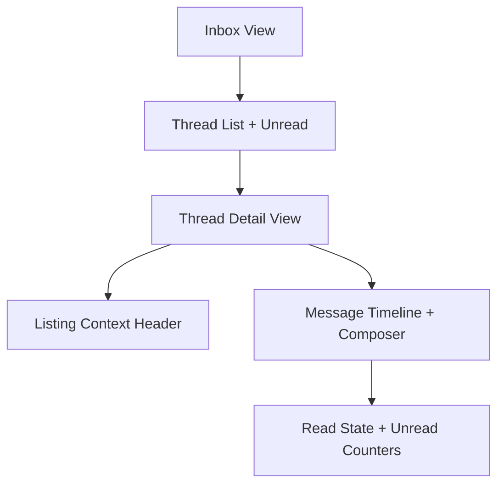

# Messaging Workspace and Conversation Context — Design Document

## Overview

This design aligns inbox and thread detail into one coherent workspace contract while reusing current models and SSE behavior.

## Design Goals

1. Fast conversation resumption from inbox.
2. Persistent listing context inside thread.
3. Reliable unread/read signaling.

## Reuse-First Architecture

## Affected Surfaces

- `marketplace/inbox.html`
- `marketplace/thread_detail.html`
- Nav unread badge integration

## Behavioral Design

- Inbox emphasizes latest active threads.
- Thread header always includes listing and counterparty context.
- “Back to messages” path is consistent.
- Unread indicators align with thread read-state.

## Testing Strategy

- Inbox ordering/unread tests
- Thread context header presence tests
- Read-state update tests on open/send
- End-to-end transition tests from listing/watchlist/discover entry points

## Risks and Mitigations

- Risk: unread drift across surfaces.
  - Mitigation: single helper contract for unread computation + integration tests.
