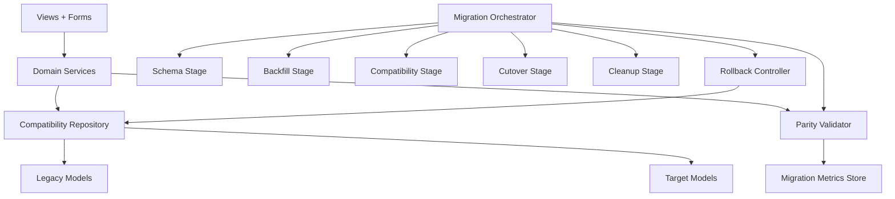

# Migration Safety and Compatibility Rails Design Document

## Overview

This design defines a staged migration pipeline that preserves current runtime behavior while moving from role-based users and split listing models to a role-agnostic user model and unified `Listing` model. The approach uses additive schema changes first, deterministic backfill, compatibility-mode read/write controls, checkpointed cutover, and rollback-safe cleanup. The stack remains Django ORM + migrations + management commands, with compatibility behavior isolated behind service/repository boundaries rather than spread across view logic. The core design decision is to treat migration as an operational workflow with explicit gates, metrics, and reversible checkpoints.

## Architecture



**Key Architectural Principles:**

- Behavior parity first: user-visible behavior remains unchanged until cutover gates are satisfied.
- Additive before destructive: no schema or data deletion before cutover success is validated.
- Single migration control plane: staged orchestration with explicit checkpoints and metrics.
- Compatibility isolation: dual-read/dual-write logic belongs in dedicated repositories/services, not in templates/views.
- Deterministic reversibility: every irreversible step is delayed until prior checkpoints pass.

## Components and Interfaces

### MigrationOrchestrator Module

Coordinates stage execution and enforces checkpoint gates.

**Key Methods:**

- `plan(): MigrationPlan` - Builds ordered stages, dependencies, and checkpoint definitions.
- `run_stage(stage_name: str): StageResult` - Executes one stage with validation.
- `advance_to(checkpoint: str): CheckpointResult` - Moves pipeline to a named checkpoint only if gates pass.
- `rollback_to(checkpoint: str): RollbackResult` - Restores previous canonical behavior for that checkpoint.

### CompatibilityRepository Module

Central adapter for legacy + target model reads/writes during compatibility window.

**Key Methods:**

- `write_user_profile(change: UserChange): WriteResult` - Applies dual write for user fields during transition.
- `write_listing(change: ListingChange): WriteResult` - Applies dual write for listing mutations.
- `read_listing(query: ListingQuery): ListingReadResult` - Performs canonical read path with fallback.
- `write_message_thread(change: ThreadChange): WriteResult` - Maintains thread consistency across schemas.

### BackfillEngine Module

Runs deterministic, idempotent backfills with traceability.

**Key Methods:**

- `backfill_users(batch: BatchSpec): BackfillBatchResult` - Maps user/org data into target user shape.
- `backfill_listings(batch: BatchSpec): BackfillBatchResult` - Maps `DemandPost`/`SupplyLot` into unified target listing rows.
- `backfill_threads_and_watchlist(batch: BatchSpec): BackfillBatchResult` - Reconciles listing-linked messaging/watchlist associations.
- `reconcile(scope: ReconcileScope): ReconcileResult` - Produces parity reports and unresolved record sets.

### ParityValidator Module

Validates behavior and data parity before checkpoint promotion.

**Key Methods:**

- `validate_counts(scope: ValidationScope): ValidationResult` - Record totals and status/category/type distributions.
- `validate_relationships(scope: ValidationScope): ValidationResult` - Ownership/thread/watchlist integrity.
- `validate_user_flows(scope: ValidationScope): ValidationResult` - CRUD/discover/watchlist/messaging/profile parity checks.
- `validate_cutover_readiness(): GateResult` - Final gate decision for cutover.

### MigrationControl Interface

```typescript
interface MigrationControl {
  mode: "legacy" | "compatibility" | "target";
  dualWriteEnabled: boolean;
  dualReadEnabled: boolean;
  writeCanonical: "legacy" | "target";
  readCanonical: "legacy" | "target";
  currentCheckpoint: string;
}
```

### BackfillAuditRecord Interface

```typescript
interface BackfillAuditRecord {
  entityType: "user" | "listing" | "thread" | "watchlist";
  sourcePk: number;
  targetPk: number | null;
  status: "success" | "failed" | "skipped";
  reasonCode: string | null;
  migratedAt: string;
}
```

### CheckpointGate Interface

```typescript
interface CheckpointGate {
  checkpoint: string;
  requiredValidations: string[];
  maxErrorRate: number;
  rollbackTarget: string;
  destructiveOpsAllowed: boolean;
}
```

## Data Models

### MigrationState Entity

Tracks pipeline progress and active compatibility settings.

```typescript
interface MigrationState {
  id: string;
  mode: "legacy" | "compatibility" | "target";
  stage: "schema" | "backfill" | "compat" | "cutover" | "cleanup";
  checkpoint: "CP0" | "CP1" | "CP2" | "CP3" | "CP4";
  dualWriteEnabled: boolean;
  dualReadEnabled: boolean;
  readCanonical: "legacy" | "target";
  writeCanonical: "legacy" | "target";
  updatedAt: string;
}
```

**Validation Rules:**

- `checkpoint`: must advance monotonically unless a rollback operation is executed.
- `dualWriteEnabled`: must be true whenever `writeCanonical = legacy` and target writes are required for parity.
- `destructive cleanup`: prohibited before `checkpoint = CP4` and cutover validations pass.

### LegacyToTargetMapping Entity

Stores stable identity linkage for traceability and reconciliation.

```typescript
interface LegacyToTargetMapping {
  id: string;
  entityType: "user" | "listing" | "thread" | "watchlist";
  legacyPk: number;
  targetPk: number;
  mappingVersion: number;
  createdAt: string;
}
```

**Validation Rules:**

- `(entityType, legacyPk)` must be unique.
- `targetPk` must reference an existing target row.

### ParityReport Entity

Captures stage-level validation evidence used for checkpoint gates.

```typescript
interface ParityReport {
  id: string;
  stage: string;
  scope: string;
  passed: boolean;
  totalChecked: number;
  failures: number;
  failureSummary: string;
  generatedAt: string;
}
```

**Validation Rules:**

- `passed` is true only when `failures / totalChecked` is within gate threshold.
- `failureSummary` must include actionable categories when `passed = false`.

### Storage Format

- Schema migrations are forward-only additive until cleanup stage.
- Backfill audit and mapping data are persisted in dedicated migration support tables.
- Compatibility control state is persisted (not process-memory only) so deploy/restart is safe.
- No legacy table/field deletion occurs until post-cutover checkpoint gates pass.

## Cutover Sequencing

### Phase Sequence

1. `CP0 - Baseline`: Legacy canonical read/write only; baseline parity snapshots captured.
2. `CP1 - Additive Schema Ready`: Target tables/columns introduced; no canonical behavior changes.
3. `CP2 - Backfill Complete`: Backfill executed + reconciled; unresolved failures below threshold.
4. `CP3 - Compatibility Stable`: Dual write and controlled dual read running with stable parity metrics.
5. `CP4 - Target Cutover`: Canonical reads/writes switch to target; legacy kept for rollback window.
6. `CP5 - Cleanup`: Legacy destructive operations allowed only after rollback window closes and parity remains stable.

### Canonical Read/Write Plan

- Pre-CP3: canonical read/write = legacy.
- CP3: canonical write = legacy with dual write to target; selective dual-read validation paths enabled.
- CP4: canonical read = target; canonical write = target; legacy writes disabled; optional legacy read fallback retained only for rollback window.
- CP5: fallback disabled; legacy schema cleanup permitted.

## Rollback Strategy

### Checkpoint Rollback Matrix

| Failed At | Rollback Target | Recovery Action |
|-----------|------------------|-----------------|
| CP1 | CP0 | Disable compatibility controls; run on legacy only |
| CP2 | CP1 | Keep target schema, disable cutover progression, rerun backfill batches |
| CP3 | CP2 | Disable dual-read, keep dual-write optional for data continuity |
| CP4 | CP3 | Revert canonical reads/writes to legacy/compat mode using mappings and audit trail |
| CP5 | CP4 | Not allowed once destructive cleanup is executed |

### Rollback Rules

- Rollback is allowed through CP4.
- Destructive cleanup is blocked until rollback window closure criteria are met.
- Rollback procedure must be executable without manual data surgery for launch-critical entities.

## Error Handling

### Migration and Backfill Errors

| Error Type | Condition | Recovery Strategy |
|------------|-----------|-------------------|
| `SchemaApplyFailure` | Additive migration fails | Halt stage; remain at prior checkpoint; no destructive actions |
| `BackfillTransformFailure` | Record cannot map to target schema | Mark failed in audit log; exclude cutover; remediate + replay |
| `MappingConflict` | Duplicate or inconsistent legacy-to-target mapping | Block checkpoint promotion; reconcile and rerun validation |
| `ParityGateFailure` | Validation thresholds not met | Keep canonical behavior unchanged; remediate and rerun gates |

### Compatibility Runtime Errors

| Error Type | Condition | Recovery Strategy |
|------------|-----------|-------------------|
| `DualWriteDivergence` | Legacy write succeeds but target write fails (or inverse) | Raise critical alert; quarantine affected records; block checkpoint advancement |
| `DualReadMismatch` | Canonical and fallback reads disagree materially | Route to canonical safe path; log mismatch; investigate before cutover |
| `CutoverHealthFailure` | Post-cutover launch-critical flow regression | Trigger checkpoint rollback procedure |

### Recovery Strategies

- **Automatic Retry**: Idempotent backfill batches and parity validations may retry with bounded attempts.
- **Fallback State**: Legacy canonical path remains default until CP4 gate pass.
- **Operator Notification**: Checkpoint failures and divergence events must emit actionable alerts with record-level IDs.

## Testing Strategy

### Unit Tests

- `BackfillEngine`: deterministic mapping, idempotency, failure logging behavior.
- `CompatibilityRepository`: canonical read order, fallback behavior, dual-write divergence handling.
- `ParityValidator`: gate threshold evaluation and failure categorization.
- `MigrationOrchestrator`: checkpoint transitions, blocked transitions, rollback transitions.

### Integration Tests

- Full stage progression CP0 -> CP4 with seed data covering role-based users, organizations, both listing types, watchlist items, threads, and messages.
- Behavior parity tests for listing create/edit/delete, discover/search, watchlist save/archive, message thread creation, inbox/thread view, profile display/edit.
- Cutover simulation with post-cutover smoke checks and CP4 rollback drill.
- Non-goal enforcement tests confirming no new marketplace features are introduced in this migration.

### Validation Gates (Pre-Cutover)

- Record count parity for users, active listings, watchlist items, message threads, messages.
- Integrity parity for ownership relationships and unique thread/listing initiator constraints.
- Status/type/category distribution parity within accepted thresholds.
- Launch-critical end-to-end flows pass without role-based branching.

### Test Organization

- Migration tests: Django migration test modules under `marketplace/tests/`.
- Service-level compatibility/backfill tests: `marketplace/tests/` dedicated migration safety test files.
- Validation commands smoke tests: management-command style tests in same test suite.

## Scope Boundaries

- In scope: migration safety mechanics for role-agnostic user and unified listing architecture, compatibility controls, rollback rails, cutover gates.
- Out of scope: new launch features and deferred marketplace capabilities (payments, escrow, auctions, bidding, logistics).
- Constraint: preserve current user-visible product behavior throughout compatibility window and until cutover success is validated.
