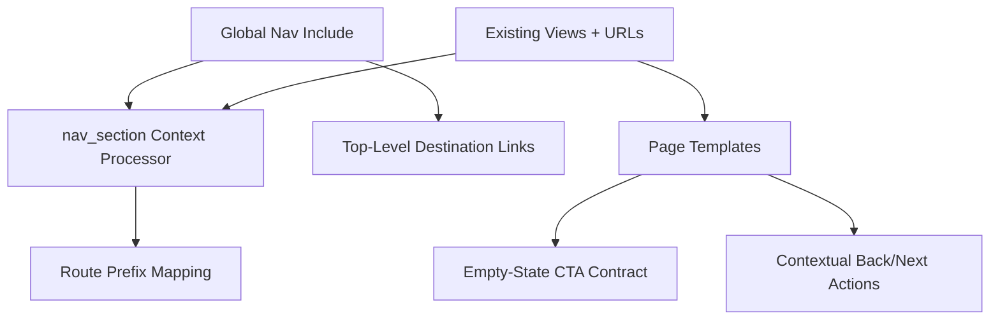

# Navigation and Information Architecture Unification — Design Document

## Overview

This design unifies navigation behavior and IA structure across the current Django server-rendered application. It is reuse-first and behavior-first:

- Reuse existing routes, views, templates, and context processors
- Avoid introducing new frontend frameworks
- Prioritize predictable navigation semantics over visual restyling

The implementation focuses on route/section mapping correctness, consistent global navigation contracts, and dead-end recovery CTAs across major pages.

## Design Goals

1. Make top-level destinations consistently reachable and consistently named.
2. Ensure active-state behavior is accurate for all canonical route families.
3. Remove structural dead ends by enforcing clear next-action patterns.
4. Preserve existing authorization and domain logic.
5. Minimize churn by using existing template include architecture.

## Current-State Gaps (From UX Artifacts + Code)

1. **Route mapping drift:** nav section mapping includes prefixes not aligned with current route families (`/demands`, `/supply`) while canonical paths are `/wanted` and `/available`.
2. **Naming drift across docs/surfaces:** mixed terminology (`Saved` vs `Watchlist`, `My Listings` vs separate `Supply`/`Demand`) creates IA ambiguity.
3. **Uneven empty-state guidance:** some pages provide strong next-step CTAs while others provide text-only guidance.
4. **Contextual-return inconsistency risk:** transitions between list/detail/thread flows can feel disconnected without consistent return affordances.

## Reuse-First Architecture

## Components and Files Affected

### Primary Existing Files

- `marketplace/context_processors.py` (`nav_section`)
- `templates/includes/_navbar.html`
- `templates/base.html`
- Page templates for:
  - `marketplace/discover.html`
  - `marketplace/watchlist.html`
  - `marketplace/inbox.html`
  - `marketplace/thread_detail.html`
  - `marketplace/supply_lot_*.html`
  - `marketplace/demand_post_*.html`
  - `marketplace/dashboard.html`
  - `registration/*.html` (unauthenticated entry flows)

### No New Core Domain Models Required

This spec is IA/navigation behavior; no schema changes required.

## Navigation Contract Design

### Authenticated Global Navigation

Canonical items:

- Discover
- Messages
- Watchlist
- Supply
- Demand
- Profile
- Log out

Behavior:

- Visible on all authenticated user-facing pages
- Same labels and destination links everywhere
- Active state derives from centralized section mapping

### Unauthenticated Navigation

Canonical items:

- Log in
- Sign up

Visible on auth/verification pages without exposing authenticated destinations.

## Active-State Mapping Design

### Centralized Mapping Strategy

Implement explicit route family mapping in one place (`nav_section` processor), using current canonical path families:

- `/` -> `dashboard`
- `/discover` -> `discover`
- `/watchlist` -> `watchlist`
- `/messages` and `/threads` -> `messages`
- `/profile` -> `profile`
- `/available` and `/wanted` -> `listings`

Legacy/non-canonical prefixes should not be treated as authoritative active-state signals.

### Active-State Safety

- Unknown path -> no incorrect highlighted item
- Nested detail/edit/delete/toggle paths inherit parent section

## Contextual Navigation Design

### Listing Management Flows

- List -> Detail -> Edit -> Detail
- Detail -> Delete Confirm -> (Delete -> List) or (Cancel -> Detail)
- Detail -> Thread (via conversations/suggestion actions) -> back path remains clear

### Messaging Flows

- Inbox -> Thread -> Inbox (explicit “Back to messages”)
- Discover/Listings/Watchlist message actions route to thread while preserving listing context in thread header

### Discover/Watchlist Flows

- Discover Save/Unsave keeps discover state continuity
- Watchlist item actions return to watchlist with clear affordances to continue

## Empty-State CTA Contract

Define reusable behavioral contract for major empty states:

- Each empty state must include one primary next action link/button.
- CTA targets should route directly to the next most likely user task.

Examples:

- No messages -> Discover or Watchlist/message-start path
- No watchlist items -> Discover
- No listings -> Create Supply / Create Demand

## Accessibility and Testing Design

### Accessibility

- Preserve semantic `<nav>` and clear link labels.
- Active-state indication must be perceivable (not color-only).
- CTA links/buttons in empty states must be keyboard reachable and labeled.

### Test Strategy

Add/extend tests to verify:

1. Correct nav active-state for each canonical route family
2. No false active-state on unknown paths
3. Presence of primary CTA in major empty-state pages
4. Key contextual transitions preserve expected return paths

## Rollout Plan

1. Fix and centralize `nav_section` mapping logic.
2. Normalize global nav labels/destinations in `_navbar.html`.
3. Standardize empty-state CTA presence across major pages.
4. Validate contextual back/next paths on listing and messaging surfaces.
5. Run regression suite for permissions and core workflows.

## Risks and Mitigations

- Risk: Navigation changes inadvertently break user habits.
  - Mitigation: Keep destination URLs stable; change labels/active behavior first.
- Risk: Overreach into visual redesign scope.
  - Mitigation: Restrict this spec to IA/behavior contracts, not full UI visual overhaul.
- Risk: Hidden edge-paths miss active-state mapping.
  - Mitigation: Add route-family coverage tests with explicit fixtures.

## Open Design Decisions

1. Should global nav keep separate `Supply` and `Demand` links long-term, or converge to a combined listings hub later?
2. For empty inbox state, should primary CTA target Discover only, or offer two equal CTAs (Discover + Watchlist)?
3. Should auth pages keep minimal nav only, or include a branded home/about link in future?

