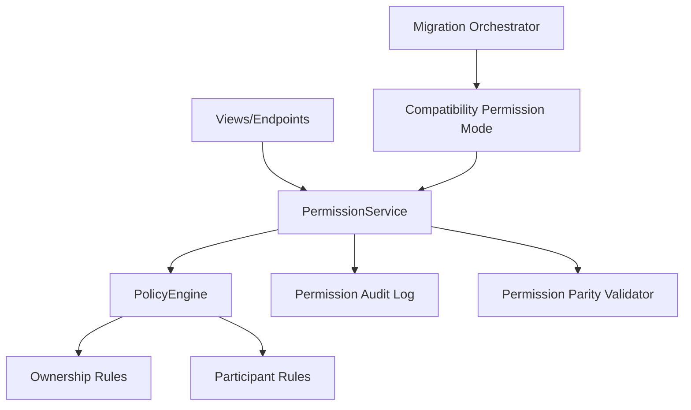

# Ownership-Based Permission Policy Design Document

## Overview

This design replaces role-based authorization with ownership and participation-based policy evaluation for listing, messaging, and watchlist flows. The solution introduces a centralized permission policy layer and migrates call sites incrementally through compatibility validation gates. Denials are structured and auditable to detect drift and ensure parity during transition. Sequencing and rollback are controlled by `migration-safety-and-compatibility-rails`.

## Dependency Alignment

- **Required predecessor:** `migration-safety-and-compatibility-rails`
- Permission cutover is checkpoint-gated and parity-validated.
- Legacy role-check removal is deferred until cleanup gate approval.
- Rollback uses predecessor checkpoint restoration behavior.

## Architecture



**Key Architectural Principles:**

- Single policy source for launch-critical authorization decisions.
- Ownership first: listing ownership and thread participation determine access.
- Deterministic deny on unresolved ownership/participant context.
- Compatibility parity checks before role-check removal.

## Components and Interfaces

### PermissionService Module

**Key Methods:**

- `authorize_listing_mutation(user_id: int, listing_id: int, action: string): Decision`
- `authorize_thread_access(user_id: int, thread_id: int, action: string): Decision`
- `authorize_watchlist_action(user_id: int, watchlist_item_id: int, action: string): Decision`

### PolicyEngine Module

**Key Methods:**

- `is_listing_owner(user_id: int, listing_id: int): boolean`
- `is_thread_participant(user_id: int, thread_id: int): boolean`
- `is_self_message_attempt(user_id: int, listing_id: int): boolean`

### PermissionParityValidator Module

**Key Methods:**

- `compare_legacy_vs_ownership_policy(scope: string): ParityResult`
- `validate_permission_cutover_readiness(): GateResult`

### Decision Interface

```typescript
interface Decision {
  allowed: boolean;
  ruleId: string;
  reasonCode: string;
  subjectType: "listing" | "thread" | "watchlist";
  subjectId: number;
}
```

## Data Models

### PermissionAuditRecord Entity

```typescript
interface PermissionAuditRecord {
  userId: number;
  subjectType: "listing" | "thread" | "watchlist";
  subjectId: number;
  action: string;
  allowed: boolean;
  ruleId: string;
  reasonCode: string;
  createdAt: string;
}
```

**Validation Rules:**

- All denials must emit structured reason codes.
- Reason codes must map to documented policy rules.

### Policy Contract

- Listing mutations require `user == listing.created_by_user`.
- Message initiation requires `user != listing.created_by_user`.
- Thread access requires participant membership.
- Watchlist mutations require watchlist ownership.

## Cutover Design

1. Introduce centralized permission service and parity logging.
2. Route launch-critical endpoints through permission service in compatibility mode.
3. Compare legacy vs ownership-policy decisions and remediate mismatches.
4. Promote ownership policy to canonical authorization source when gates pass.
5. Remove legacy role-based checks in cleanup stage.

## Error Handling

| Error Type | Condition | Recovery Strategy |
|------------|-----------|-------------------|
| `OwnershipResolutionError` | Listing owner cannot be resolved | Deny action, log structured context |
| `ParticipantResolutionError` | Thread participant set unresolved | Deny action, log structured context |
| `PolicyDriftDetected` | Different outcomes across policy paths | Block cutover and remediate route logic |
| `PostCutoverAuthRegression` | Launch-critical authorization regression | Rollback to prior checkpoint |

## Testing Strategy

### Unit Tests

- Ownership and participant rule predicates.
- Self-message block behavior.
- Deterministic deny behavior and reason codes.

### Integration Tests

- Owner-allowed/non-owner-denied listing actions.
- Participant-only thread access and messaging.
- Watchlist ownership mutation constraints.
- Compatibility parity test between legacy and ownership policy decisions.

### Gate Criteria

- No launch-critical endpoint bypasses permission service.
- Permission parity mismatches below threshold.
- No role-based branching remains in canonical permission paths.

## Scope Boundaries

- In scope: policy source transition and centralized enforcement for listing/thread/watchlist.
- Out of scope: listing schema redesign, thread schema redesign, discover UX changes, deferred marketplace features.
