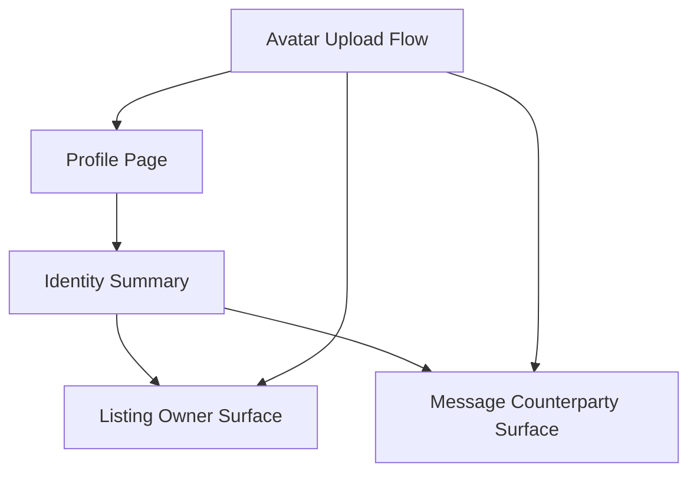

# Profile and Trust Surfaces — Design Document

## Overview

This design aligns identity presentation across profile, listing detail, and messaging surfaces, using existing profile/avatar infrastructure.

## Design Goals

1. Improve trust and identity clarity.
2. Keep identity surfaces consistent.
3. Preserve existing profile and avatar backend behavior.

## Reuse-First Architecture

## Affected Surfaces

- `marketplace/profile.html`
- `marketplace/profile_edit.html`
- `marketplace/supply_lot_detail.html`
- `marketplace/demand_post_detail.html`
- `marketplace/thread_detail.html`

## Behavioral Design

- Keep display name/avatar fallback rules consistent.
- Ensure profile edit/update feedback is explicit.
- Maintain clear profile navigation and return paths.

## Testing Strategy

- Profile view/edit flow tests
- Avatar fallback and update propagation tests
- Listing/thread identity display consistency tests

## Risks and Mitigations

- Risk: inconsistent identity rendering by template.
  - Mitigation: common display contract + cross-template tests.
