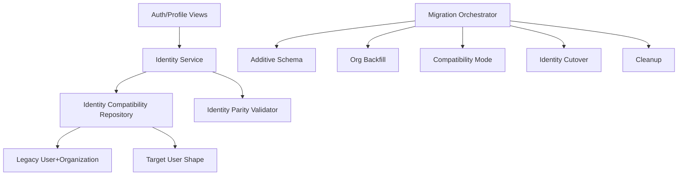

# Role-Agnostic User and Org Flattening Design Document

## Overview

This design removes role as a persistent identity axis and flattens organization name onto `User` while preserving behavior during migration. The implementation follows the control-plane, checkpoint, and rollback mechanics defined in `migration-safety-and-compatibility-rails`. Identity writes and reads are routed through compatibility adapters until cutover gates pass. Runtime behavior for auth and profile flows remains stable through additive schema, backfill, compatibility, and cutover stages.

## Dependency Alignment

- **Required predecessor:** `migration-safety-and-compatibility-rails`
- All schema operations follow additive-first sequencing.
- All cutover transitions are checkpoint-gated and rollback-capable.
- No destructive removal of `User.role` or `Organization` occurs before predecessor cleanup gates.

## Architecture



**Key Architectural Principles:**

- Role is not an authorization or profile state source.
- `User.organization_name` is canonical organization display field.
- Compatibility logic is centralized in service/repository layer.
- Legacy identity structures remain until cutover + rollback window close.

## Components and Interfaces

### IdentityService Module

Coordinates identity profile semantics for auth/profile surfaces.

**Key Methods:**

- `get_profile(user_id: int): IdentityProfile`
- `update_profile(user_id: int, change: IdentityChange): UpdateResult`
- `validate_identity_cutover_readiness(): GateResult`

### IdentityCompatibilityRepository Module

Encapsulates dual-write and dual-read behavior for user/org transition.

**Key Methods:**

- `write_identity(change: IdentityChange): WriteResult`
- `read_identity(user_id: int): IdentityProfile`
- `backfill_org_name(batch_spec: BatchSpec): BackfillBatchResult`

### IdentityComplianceScanner Module

Detects residual role-based code path usage.

**Key Methods:**

- `scan_role_branching(): ComplianceReport`
- `scan_org_runtime_dependencies(): ComplianceReport`

### IdentityProfile Interface

```typescript
interface IdentityProfile {
  userId: number;
  email: string;
  displayName: string;
  organizationName: string | null;
  timezone: string | null;
  distanceUnit: string;
  skin: string;
}
```

### IdentityChange Interface

```typescript
interface IdentityChange {
  displayName?: string;
  organizationName?: string | null;
  timezone?: string | null;
  distanceUnit?: string;
  skin?: string;
}
```

## Data Models

### Target User Fields

```typescript
interface TargetUserIdentity {
  id: number;
  organizationName: string | null;
  roleFieldPresent: false;
}
```

**Validation Rules:**

- `organizationName` is optional and length-bounded.
- Empty input normalizes to null-equivalent behavior.
- Existing validation rules for unaffected fields are retained.

### OrgBackfillAudit Entity

```typescript
interface OrgBackfillAudit {
  userId: number;
  sourceOrganizationId: number | null;
  resolvedOrganizationName: string | null;
  status: "success" | "failed" | "skipped";
  reasonCode: string | null;
  processedAt: string;
}
```

**Validation Rules:**

- One latest audit outcome per user per backfill run.
- Ambiguity resolution must be deterministic and reason-coded.

## Backfill and Cutover Design

1. Add `organization_name` as optional on `User`.
2. Backfill organization names from legacy `Organization` relation using deterministic conflict resolution.
3. Enable compatibility reads preferring target field with legacy fallback.
4. Enable compatibility writes so profile updates keep identity parity.
5. Cut over canonical reads/writes to target identity path after parity gates pass.
6. Remove runtime dependencies on `Organization` and `User.role` during cleanup stage only.

## Error Handling

| Error Type | Condition | Recovery Strategy |
|------------|-----------|-------------------|
| `OrgAmbiguityError` | Multiple possible org names for one user | Apply deterministic rule, log audit, block cutover if unresolved |
| `IdentityParityMismatch` | Legacy/target identity render mismatch | Stay in compatibility mode, remediate mapping |
| `RoleBranchingDetected` | Role-based path still active | Fail compliance gate and block cutover |
| `CutoverRegression` | Auth/profile behavior differs post-cutover | Rollback to prior checkpoint per predecessor spec |

## Testing Strategy

### Unit Tests

- Identity field normalization and validation.
- Org backfill conflict resolution behavior.
- Compatibility repository read/write preference and fallback.
- Compliance scanner detection for role/org dependencies.

### Integration Tests

- Signup/login/logout/profile view/profile edit parity across compatibility and cutover stages.
- Identity display parity in listings and messaging surfaces.
- Cutover + rollback drill for identity subsystem.

### Gate Criteria

- No role-based branching in identity/auth/profile code paths.
- Identity parity checks pass across launch-critical flows.
- Org flattening backfill failures are under allowed threshold.

## Scope Boundaries

- In scope: user role removal from identity model, org flattening, compatibility/cutover logic.
- Out of scope: permission policy overhaul, listing unification, discover behavior changes, deferred marketplace features.
