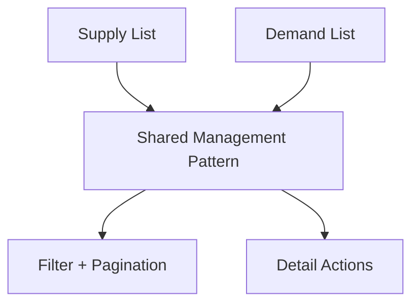

# Supply and Demand Listing Management Hub — Design Document

## Overview

This design aligns supply and demand management pages as parallel operational surfaces with consistent controls, status visibility, and navigation continuity.

## Design Goals

1. Strong management readability (status + metadata).
2. Fast create/manage flows.
3. Consistent behavior between supply and demand surfaces.

## Reuse-First Architecture

## Affected Surfaces

- `marketplace/supply_lot_list.html`
- `marketplace/demand_post_list.html`
- `templates/includes/_listing_filter.html`
- Related detail pages for management action continuity

## Behavioral Design

- Keep supply/demand list structures parallel.
- Preserve type-specific semantics while sharing interaction pattern.
- Maintain clear create CTA and status visibility.

## Testing Strategy

- Supply/demand list parity tests
- Filter behavior tests
- Pagination tests
- Action transition tests (list -> detail -> action -> return)

## Risks and Mitigations

- Risk: divergence between supply and demand templates.
  - Mitigation: shared management contract and parity test coverage.
