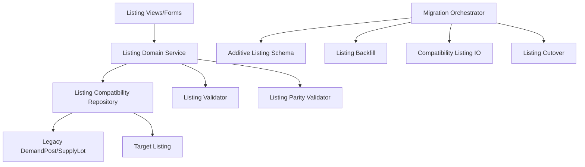

# Unified Listing Model and Status Contract Design Document

## Overview

This design introduces a single canonical `Listing` model that represents supply and demand via a `type` enum, with type-specific nullable columns and unified status semantics. The migration preserves behavior by routing listing access through compatibility adapters until cutover validation passes. Status and field validity are enforced at the domain validation layer, with parity checks against legacy listing behavior. All sequencing and rollback behavior depend on `migration-safety-and-compatibility-rails`.

## Dependency Alignment

- **Required predecessor:** `migration-safety-and-compatibility-rails`
- Listing schema changes are additive-first and checkpoint-gated.
- Backfill and cutover run only under predecessor compatibility controls.
- Legacy table removal is deferred to predecessor cleanup stage.

## Architecture



**Key Architectural Principles:**

- One listing table with explicit type semantics.
- Nullable type-specific columns; no polymorphic JSON or multi-table inheritance.
- Unified status field with explicit type-specific validity rules.
- Compatibility logic centralized outside views.

## Components and Interfaces

### ListingDomainService Module

**Key Methods:**

- `create_listing(input: ListingInput): ListingResult`
- `update_listing(listing_id: int, change: ListingChange): ListingResult`
- `transition_status(listing_id: int, status: ListingStatus): ListingResult`
- `validate_listing_cutover_readiness(): GateResult`

### ListingCompatibilityRepository Module

**Key Methods:**

- `write_listing(change: ListingChange): WriteResult`
- `read_listing(listing_id: int): ListingRecord`
- `search_listings(query: ListingQuery): ListingPage`
- `backfill_legacy_listings(batch_spec: BatchSpec): BackfillBatchResult`

### ListingValidator Module

**Key Methods:**

- `validate_type_specific_fields(listing: ListingRecord): ValidationResult`
- `validate_status_transition(listing: ListingRecord, next_status: ListingStatus): ValidationResult`

### ListingRecord Interface

```typescript
interface ListingRecord {
  id: number;
  type: "SUPPLY" | "DEMAND";
  createdByUserId: number;
  title: string;
  description: string;
  category: string;
  status: "ACTIVE" | "PAUSED" | "FULFILLED" | "WITHDRAWN" | "EXPIRED" | "DELETED";
  locationCountry: string;
  locationLocality: string | null;
  locationRegion: string | null;
  locationPostalCode: string | null;
  locationLat: number | null;
  locationLng: number | null;
  priceValue: string | null;
  priceCurrency: string | null;
  quantity: string | null;
  unit: string | null;
  priceUnit: string | null;
  shippingScope: string | null;
  radiusKm: number | null;
  frequency: string | null;
  createdAt: string;
  expiresAt: string | null;
}
```

## Data Models

### Listing Validation Rules

- `shippingScope` is non-null only for `SUPPLY`.
- `radiusKm` and `frequency` are non-null only for `DEMAND`.
- `FULFILLED` allowed only for `DEMAND`.
- `WITHDRAWN` allowed only for `SUPPLY`.

### LegacyListingMapping Entity

```typescript
interface LegacyListingMapping {
  legacyType: "DemandPost" | "SupplyLot";
  legacyPk: number;
  listingPk: number;
  status: "mapped" | "failed";
  reasonCode: string | null;
  mappedAt: string;
}
```

## Backfill and Cutover Design

1. Add target listing table/fields and mapping/audit support structures.
2. Backfill `DemandPost` and `SupplyLot` to `Listing` with deterministic mapping.
3. Enable compatibility writes and read validation paths.
4. Promote canonical listing reads to target when parity gates pass.
5. Disable legacy listing writes.
6. Remove legacy listing runtime dependencies during cleanup window.

## Error Handling

| Error Type | Condition | Recovery Strategy |
|------------|-----------|-------------------|
| `ListingTransformFailure` | Legacy listing cannot map to valid target row | Log failure, quarantine record, block cutover |
| `TypeConstraintViolation` | Invalid type-specific field combination | Reject write deterministically |
| `StatusContractViolation` | Invalid status for listing type | Reject transition and log violation |
| `ListingParityMismatch` | Legacy/target listing behavior diverges | Hold checkpoint and remediate |

## Testing Strategy

### Unit Tests

- Type-specific nullable field validation.
- Status contract enforcement by listing type.
- Backfill mapping and idempotent replay.
- Compatibility read/write behavior.

### Integration Tests

- Listing create/edit/detail/toggle/delete parity.
- Discover listing retrieval parity across compatibility and cutover.
- Post-cutover rollback drill for listing subsystem.

### Gate Criteria

- Listing parity tests pass across launch-critical flows.
- Mapping completeness and integrity thresholds satisfied.
- No active code path depends on legacy listing models after cutover.

## Scope Boundaries

- In scope: unified listing model, status/field validation contract, migration/cutover safety.
- Out of scope: messaging redesign, permission redesign, discover IA changes, deferred marketplace features.
