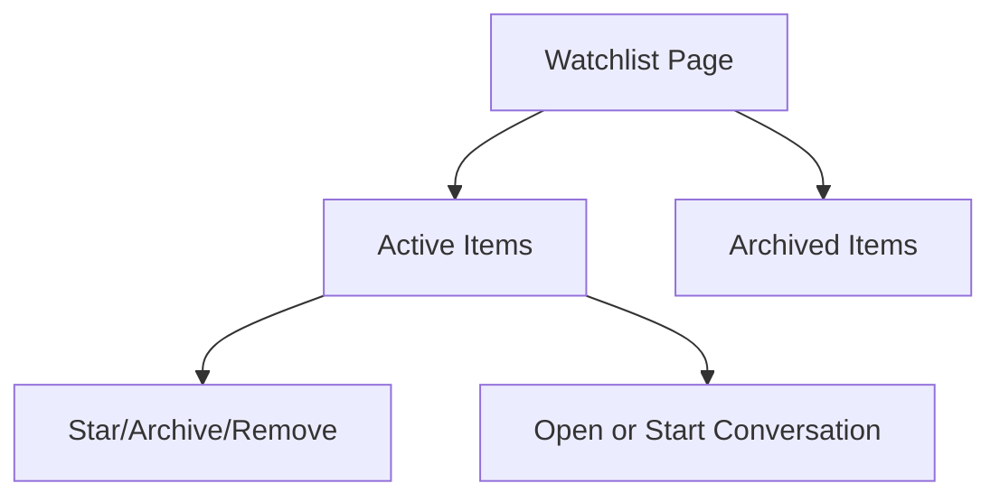

# Watchlist Follow-Up Workflow — Design Document

## Overview

This design positions watchlist as a workflow surface: track -> prioritize -> converse -> archive. It reuses existing watchlist statuses and thread coordination logic.

## Design Goals

1. Clear item state groupings.
2. Fast transition from item to conversation.
3. Predictable state actions and recovery paths.

## Reuse-First Architecture

## Affected Surfaces

- `marketplace/watchlist.html`
- `marketplace/_watchlist_card.html`
- watchlist action endpoints/views

## Behavioral Design

- Active vs archived sections stay explicit.
- Action set depends on item state.
- Thread access/action is first-class for follow-up.

## Testing Strategy

- Action-state transition tests
- Watchlist card behavior tests
- Thread access/start tests from watchlist
- Empty-state CTA test

## Risks and Mitigations

- Risk: state confusion between starred/watching/archived.
  - Mitigation: explicit labels and consistent action availability.
